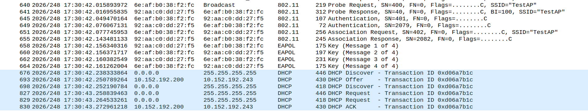
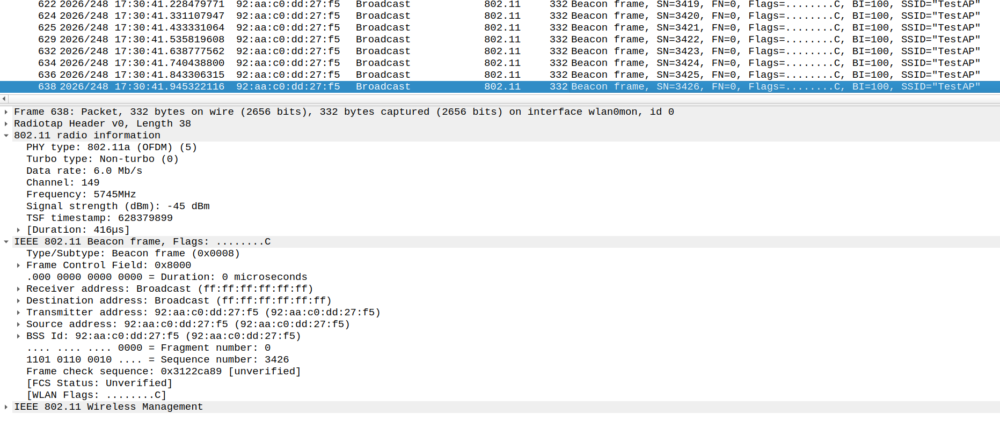
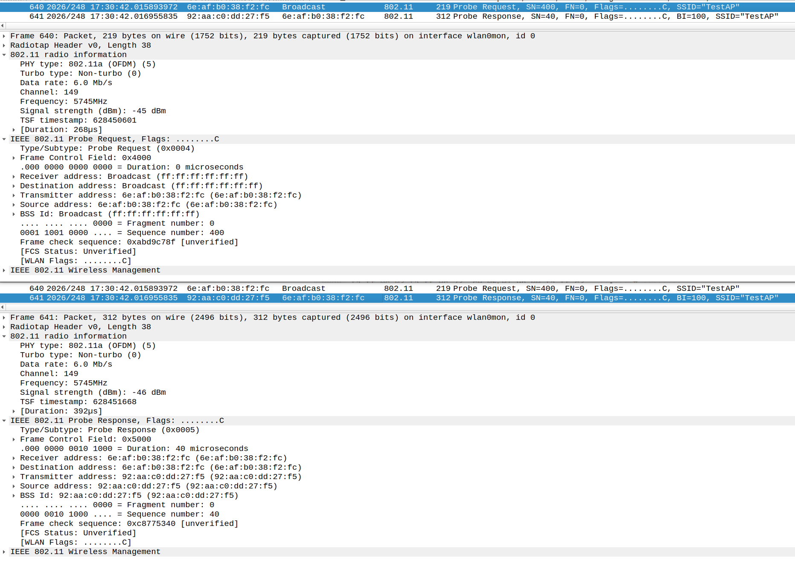
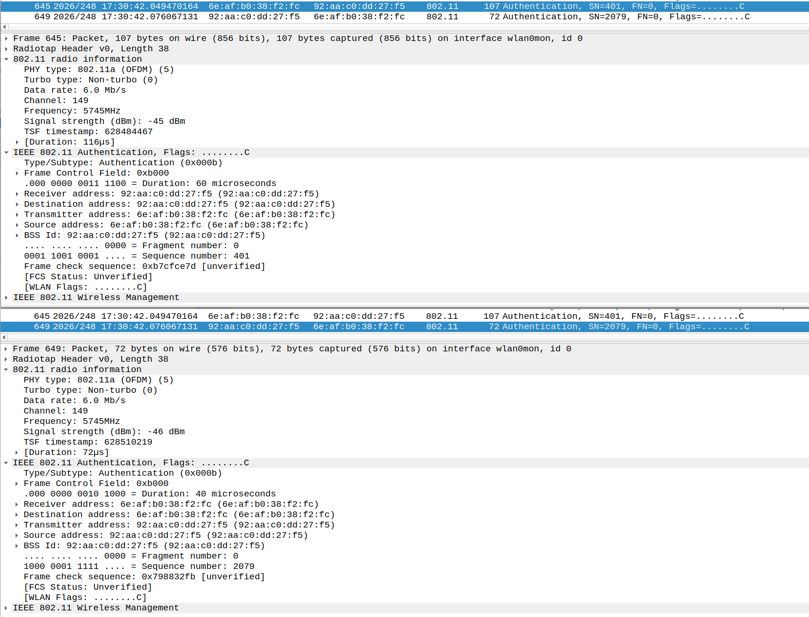
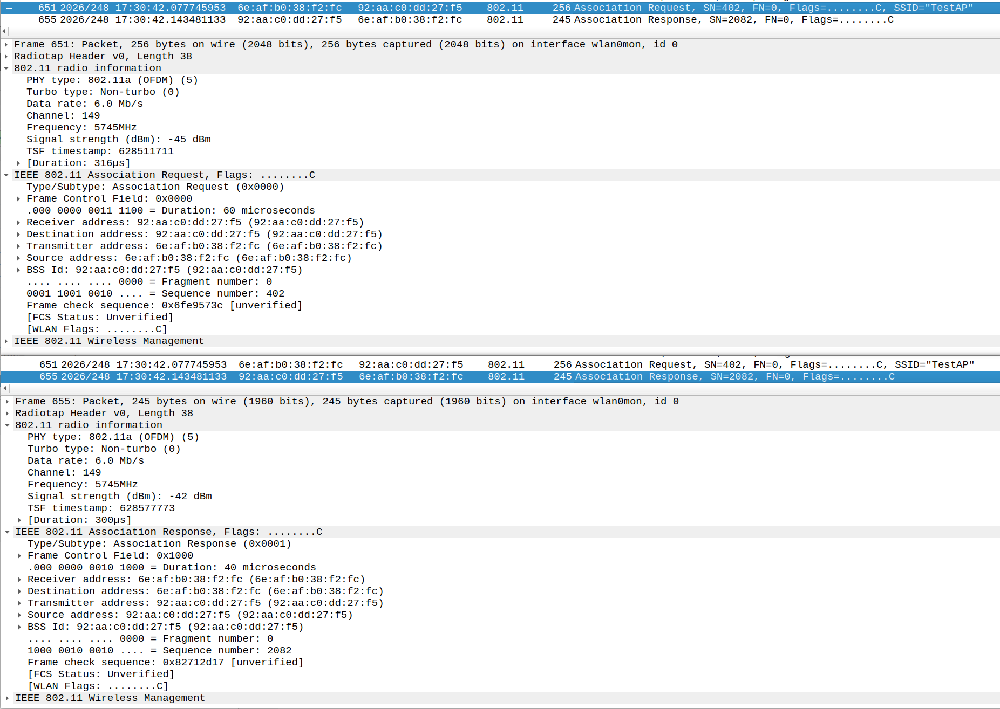
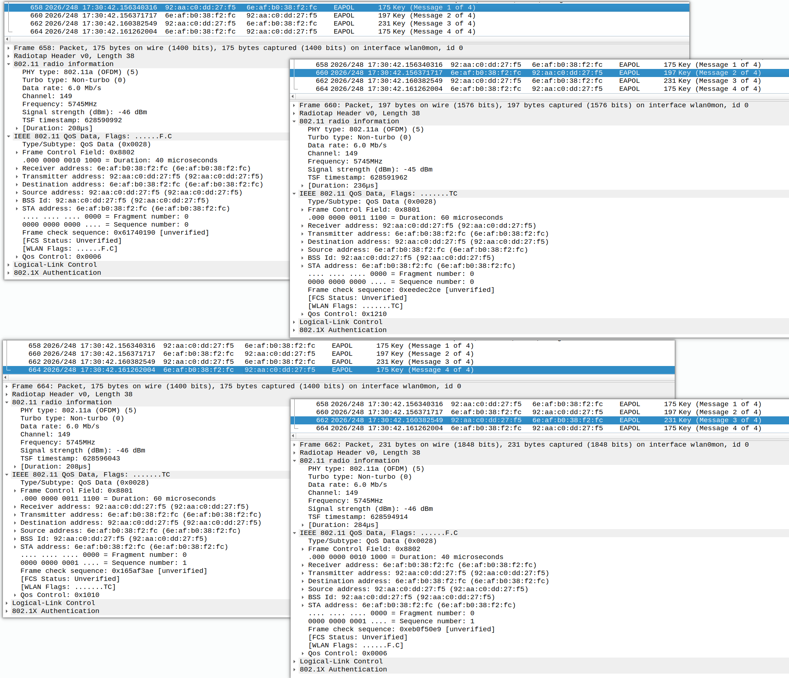
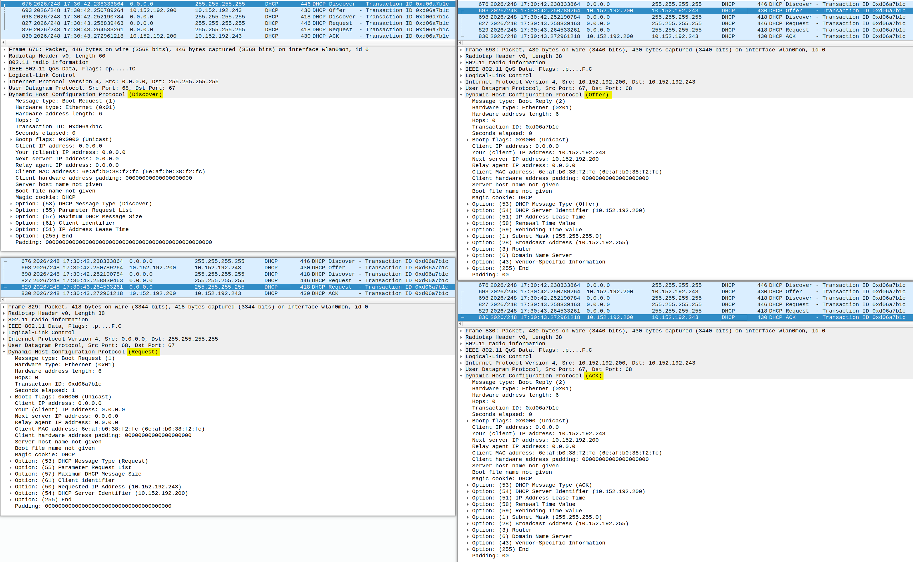

打开手机 Wi-Fi，点击一个热点，输入密码并成功连接时，从 Wi-Fi 协议的角度来看，Station 和 AP 之间经历了一系列交互。抓取WiFi 空口 Sniffer 可以看到完整的交互过程。

> 本文不深入分析每一个协议字段，只是通过一组完整的 Sniffer 抓包，从整体上认识 Station 连接 SoftAP 的全过程。


# Station 和 SoftAP 是什么？
| 术语         | 含义                | 简单理解                     |
| :---------: | :-----------------: | :-----------------------: |
| Station（STA） | Wi-Fi 客户端角色    | 主动连接 Wi-Fi 的设备         |
| AP         | Access Point        | 提供 Wi-Fi 接入服务的一端     |
| SoftAP     | Software AP         | 通过软件实现 AP 功能          |
| Station 与 STA | 二者指同一个角色    | `Station` 是完整叫法，`STA` 是缩写 |
| AP 与 SoftAP | SoftAP 是 AP 的一种实现方式 | 可理解为「软件实现的 AP」 |

```
Station                SoftAP/AP
   |       Wi-Fi 连接      |
   |<--------------------->|
```

*******************************************************************************
*******************************************************************************


# Station 连接 SoftAP 的完整过程

```
Station                    SoftAP/AP
   |                          |
   | <------- Beacon -------- |
   |                          |
   | ---- Probe Request ----> |
   | <--- Probe Response ---- |
   |                          |
   | ---- Authentication ---> |
   | <--- Authentication ---- |
   |                          |
   | ----- Association -----> |
   | <---- Association ------ |
   |                          |
   | <------ EAPOL 1 -------- |
   | ------- EAPOL 2 -------> |
   | <------- EAPOL 3 ------- |
   | ------- EAPOL 4 -------> |
   |                          |
   | ---- DHCP Discover ----> |
   | <------ DHCP Offer ----- |
   | ----- DHCP Request ----> |
   | <------- DHCP ACK ------ |
   |                          |
   | <===== 正常数据通信 =====> |
```

| 阶段编号 | 阶段名称             | 主要目的                                   |
| :------: | :----------------- | :--------------------------------------- |
| ①       | 发现 AP              | STA (Station) 找到 AP                    |
| ②       | Authentication       | 建立 802.11 认证关系                      |
| ③       | Association          | STA(Station) 与 AP 建立关联            |
| ④       | 4-Way Handshake      | 协商并建立数据加密所需的密钥               |
| ⑤       | DHCP                 | STA 获取 IP 地址等网络参数                 |


*******************************************************************************
*******************************************************************************

# 抓 WiFi 空口的环境信息
```
抓Sniffer的平台：Ubuntu22.04
抓Sniffer的工具：aircrack-ng
STA：Android 手机
SoftAP：Android 手机热点 / 路由器WiFi热点

SoftAP信息：
    SSID：TestAP
    Band：5 GHz
    Channel：149
    Bandwidth：80 MHz
    Security：WPA2-PSK
```

*******************************************************************************
*******************************************************************************

# WiFi 空口 

## 完整连接过程抓包




## 第一阶段：扫描(Scan)发现 AP/SoftAP

### 被动发现 AP/SoftAP - Beacon

Station 通过监听 Beacon 来发现附近的 AP/SoftAP

```
    SoftAP
    |
    | ---- Beacon ----> Station
    | ---- Beacon ----> Station
    | ---- Beacon ----> Station
```




### 主动发现 AP/SoftAP - Probe Request / Probe Response

Station通过主动发送Probe Request来发现附近的 AP/SoftAP

```
Station                     SoftAP
   |                           |
   | ---- Probe Request -----> |
   | <--- Probe Response ----- |
   |                           |
```




## 第二阶段：认证(Authentication)

```
Station                         SoftAP
   |                               |
   | -- Authentication Request - > |
   | <-- Authentication Response --|
```



Authentication 并不是我们通常理解的“输入 Wi-Fi 密码进行身份验证”。

对于现代 Wi-Fi 来说，这一步更多可以理解成：
双方先完成 802.11 层面的认证流程，为后面的 Association 做准备。
真正涉及 Wi-Fi 密钥建立的过程是在后面的 4-way Handshake。


## 第三阶段：关联(Association)

```
Station                    SoftAP
   |                          |
   | --- Association Req ---> |
   | <-- Association Resp --- |
```




## 第四阶段：四次握手(4-Way Handshake)

```
Station                   SoftAP
   |                         |
   | <------- EAPOL 1 -------|
   | ------- EAPOL 2 ------->|
   | <------- EAPOL 3 -------|
   | ------- EAPOL 4 ------->|
```




## 第五阶段：DHCP 获取 IP

```
Station                    SoftAP
   |                          |
   | ---- DHCP Discover ----> |
   | <----- DHCP Offer -------|
   | ---- DHCP Request ------>|
   | <------ DHCP ACK --------|
```




## 第六阶段：数据通信

```
Station                    SoftAP
   |                          |
   | <======= Wi-Fi =======>  |
   |                          |
   | <======= IP ===========> |
   |                          |
   | <======= TCP ==========> |
   |                          |
   | <======= HTTP =========> |
```


*******************************************************************************
*******************************************************************************

# 从 Sniffer 抓包重新看整个过程

```
    Station 连接 SoftAP
             │
             ▼
    ┌─────────────────┐
    │   发现 SoftAP    │
    │ Beacon / Probe  │
    └────────┬────────┘
             │
             ▼
    ┌─────────────────┐
    │ Authentication  │
    │     认证         │
    └────────┬────────┘
             │
             ▼
    ┌─────────────────┐
    │   Association   │
    │      关联         │
    └────────┬────────┘
             │
             ▼
    ┌─────────────────┐
    │ 4-way Handshake │
    │   安全建立       │
    └────────┬────────┘
             │
             ▼
    ┌─────────────────┐
    │      DHCP       │
    │ 获取 IP 网络参数  │
    └────────┬────────┘
             │
             ▼
    ┌─────────────────┐
    │   正常数据通信   │
    │ ARP / DNS / TCP │
    │ UDP / HTTP /... │
    └─────────────────┘
```