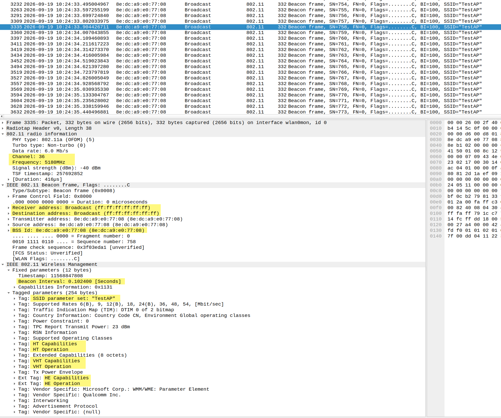
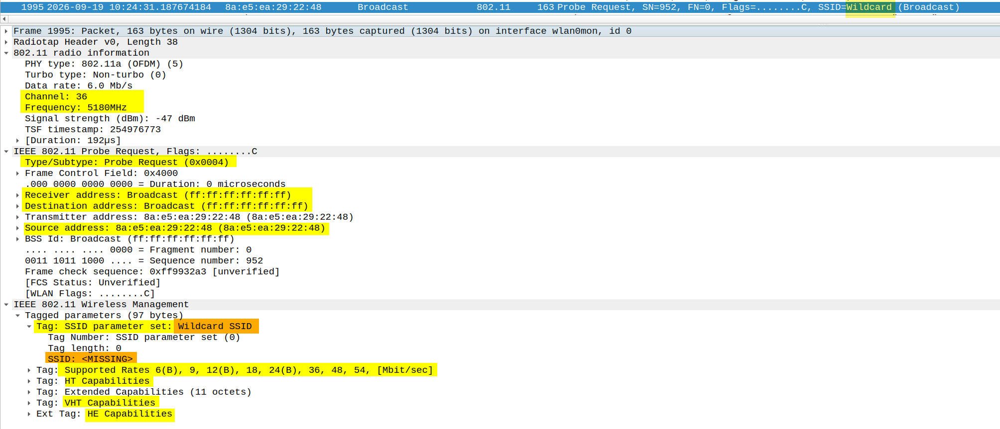
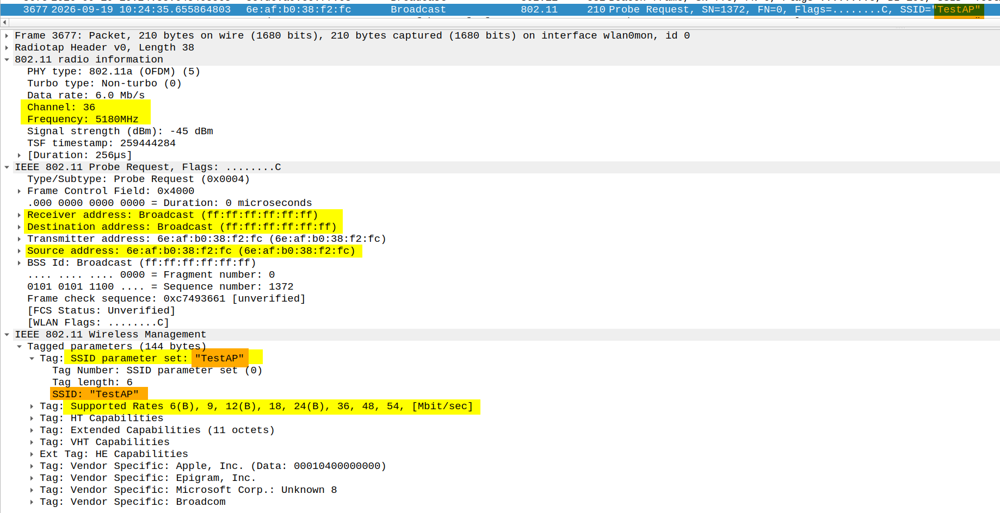
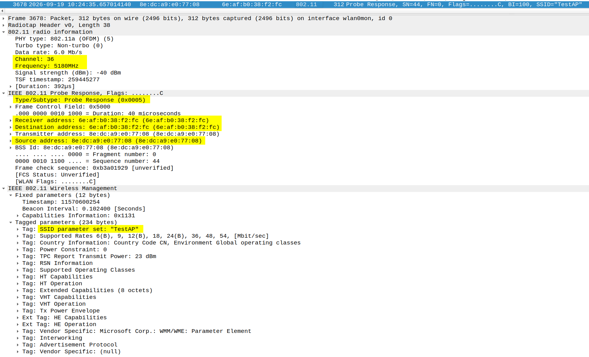
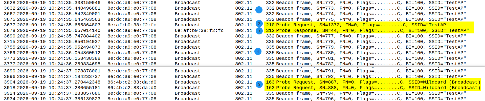
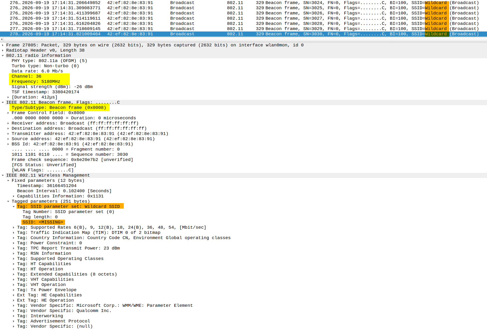

# Station 是如何发现 SoftAP的？


## 1. 手机打开Wi-Fi后，是怎么发现附近的热点的？

> 打开手机 Wi-Fi，很快就能看到附近的 Wi-Fi 列表，那么手机是怎么发现附近 Wi-Fi的？

简单来说，手机有 主动扫描 + 被动扫描/监听 两种方式来发现附近的热点。
主动扫描：手机在支持的信道上轮询发送 Probe Request，等待 SoftAP 回复 Probe Response 主动发现附近的 Wi-Fi热点。
被动扫描：手机在支持的信道上轮询监听 SoftAP 周期性广播的 Beacon 来发现 Wi-Fi热点。

```
STA 想发现 SoftAP
      │
      ├── Passive Scan
      │       ↓
      │     Beacon
      │
      └── Active Scan
              ↓
        Probe Request
              ↓
        Probe Response
```

*******************************************************************************
*******************************************************************************

## 2. Wi-Fi扫描大致发生了什么？

```
Station                    SoftAP
   |                          |
   | <------- Beacon -------- |
   |                          |
   | ---- Probe Request ----> |
   | <--- Probe Response ---- |
```

SoftAP 可以通过 Beacon 主动“广播自己的存在”，STA也可以通过 Probe Request 主动询问附近是否存在目标网络。

*******************************************************************************
*******************************************************************************

## 3. Beacon：SoftAP 主动告诉别人“我在这里”

```
Station                    SoftAP
   |                          |
   | <------- Beacon -------- |
   | <------- Beacon -------- |
   | <------- Beacon -------- |
```

Beacon 可以理解成 SoftAP 周期性发送一张“自我介绍”。例如：

```
我是 MySoftAP
我工作在 5GHz 5745信道上
我的能力是这些
我的安全配置是这些
...
```

SoftAP 会按照 Beacon Interval 周期性发送 Beacon Frame。
Beacon Interval 的单位是 TU（Time Unit），常见配置为 100 TU，也就是约 102.4 ms。
STA 可以通过接收到的 Beacon 了解附近 BSS 的基本信息。
```
1 TU = 1024 μs

100 TU = 102400 μs
       = 102.4 ms
```


### Beacon 长什么样子



| 信息                  | 用途              |
| -------------------- | --------------- |
| SSID                 | 网络名称            |
| BSSID                | AP/BSS 的 MAC 地址 |
| Channel / Frequency  | AP 工作在哪个信道/频率   |
| Beacon Interval      | Beacon 周期       |
| Capability           | BSS 的基本能力       |
| RSN                  | WPA2/WPA3 等安全能力 |
| HT                   | 802.11n 能力      |
| VHT                  | 802.11ac 能力     |
| HE                   | 802.11ax 能力     |
| Country / Regulatory | 国家/区域相关信息       |
| Supported Rates      | 支持的数据速率         |


> Beacon 中还有大量 Information Elements（IE），本文暂时不逐个展开，后续会单独分析。


*******************************************************************************
*******************************************************************************

## 4. Probe Request：STA 主动寻找 SoftAP

```
Station                    SoftAP
   |                          |
   | ---- Probe Request ----> |
   | <--- Probe Response ---- |
```

Beacon 是 SoftAP 主动广播自己的信息。
STA 也可以主动发送 Probe Request，询问附近的 SoftAP

### Probe Request 长什么样子

#### Wildcard Probe Request - 广播 Probe Request

不指定任何特定的 SSID，相当于客户端在“广撒网”式地询问当前信道上的 AP：“谁在？有哪些网络？”

- 目的地址：通常是广播地址 ff:ff:ff:ff:ff:ff。
- SSID 字段：通配符或留空。
- 用途：用于发现周围所有可用的无线网络
- Wireshark 过滤表达式：wlan.fc.type_subtype == 0x04 && wlan.da == ff:ff:ff:ff:ff:ff




#### Directed Probe Request - 定向 Probe Request

有明确目标地在当前信道上询问：“‘TesttAP’这个网络在不在附近？”

- 目的地址：可以是广播地址，也可以是特定的目的 MAC 地址，具体取决于实现。
- SSID 字段：包含客户端想要寻找的那个具体的网络名称。
- 用途：用于主动寻找指定 SSID 的网络。
- Wireshark 过滤表达式：wlan.fc.type_subtype == 0x04 && wlan.ssid == "TestAP"




*******************************************************************************
*******************************************************************************

## 5. Probe Response：SoftAP 回应 STA

```
Station                    SoftAP
   |                          |
   | ---- Probe Request ----> |
   | <--- Probe Response ---- |
```

SoftAP 收到 Probe Request 后，可以回复 Probe Response，把自己的网络信息告诉 STA。




*******************************************************************************
*******************************************************************************

## 6. Beacon 与 Probe 有什么区别？

|      | Beacon   | Probe Request | Probe Response |
| ---- | -------- | ------------- | -------------- |
| 发送方  | AP       | STA           | AP             |
| 方向   | AP → STA | STA → AP      | AP → STA       |
| 主要目的 | 广播 AP 信息 | STA 主动寻找 AP   | AP 回复 STA      |
| 是否主动 | AP主动     | STA主动         | AP响应           |
| 常见用途 | 被动扫描     | 主动扫描          | 主动扫描           |

Beacon 是 AP 主动“喊话”；Probe Request 是 STA 主动“询问”；Probe Response 是 AP 对 STA 的“回答”。

*******************************************************************************
*******************************************************************************

## 7. Active Scan 与 Passive Scan

### Passive Scan
不主动发送 Probe Request，主要通过监听 AP 的 Beacon 来发现网络。

```
Station                    SoftAP
   |                          |
   | <------- Beacon -------- |
   | <------- Beacon -------- |
   | <------- Beacon -------- |
```

### Active Scan

```
Station                    SoftAP
   |                          |
   | ---- Probe Request ----> |
   | <--- Probe Response ---- |
```

*******************************************************************************
*******************************************************************************

## 8. 一次扫描实际上是怎么进行的？

- 对于 2.4GHz 来说，扫描的大致过程如下
```
Wi-Fi Scan
    │
    │ ① 选择待扫描信道
    ├── Channel 1
    │     ├── Listen Beacon - 监听 Beacon				② Passive Scan
    │     └── Probe Request/Response - 发/收Probe		③ 或 Active Scan
    │
    ├── Channel 6
    │     ├── Listen Beacon
    │     └── Probe Request/Response
    │
    ├── Channel 11
    │     ├── Listen Beacon
    │     └── Probe Request/Response
    │
    └── ...
    │
    └── Scan Results
```

> 实际设备不一定按照上面的顺序逐个信道执行，具体扫描策略由 Android、Wi-Fi HAL、驱动和固件实现决定。


*******************************************************************************
*******************************************************************************

## 9. 从 Sniffer 抓包看一次扫描

下面通过一组实际抓包，观察 Wi-Fi Scan 中可能出现的 Beacon、Probe Request 和 Probe Response。

> 需要注意的是，实际帧的出现顺序会受到扫描策略、信道、AP 行为以及设备实现的影响，并不存在下面这种固定的帧顺序。



① Beacon
   AP周期性广播自己的存在

② Probe Request - Directed - **定向 Probe Request**
   STA主动发起扫描 - 定向扫描

③ Probe Response
   AP回应STA

④ Beacon
   AP继续周期性发送Beacon

⑤ Probe Request - Wildcard - **广播 Probe Request**
   STA主动发起扫描 - 广播扫描


*******************************************************************************
*******************************************************************************

## 10. Android 中的 Wi-Fi Scan

```
Android App / Settings
          │
          ↓
      WifiManager
          │
          ↓
 Android Wi-Fi Framework
          │
          ↓
        Wi-Fi HAL
          │
          ↓
       nl80211
          │
          ↓
 cfg80211 / Qualcomm Driver
          │
          ↓
       Firmware
          │
          ↓
       Wi-Fi Chip
          │
          ↓
     Beacon / Probe
```

本文介绍的是 802.11 空口层面的 Wi-Fi Scan。
在 Android 中，应用通常不会直接发送 Probe Request，而是通过 Android Wi-Fi Framework 发起扫描请求，底层再由 HAL、驱动和固件等组件共同完成实际扫描。不同平台的具体实现可能不同。


*******************************************************************************
*******************************************************************************

## 11. 隐藏热点

### 普通热点广播的 Beacon 中 SSID 为热点名称


### 隐藏热点广播的 Beacon 中 SSID 为空。




### 如何发现隐藏热点

- STA 通过发送 Wildcard Probe Request - 广播 Probe Request，隐藏热点收到 Probe Request 之后是不会回复 Probe Response 的。


- **STA 可以通过指定 SSID 的 Directed Probe Request 来寻找隐藏网络**。


*******************************************************************************
*******************************************************************************

## 12. 总结

```
         Station发现SoftAP
                │
      ┌─────────┴─────────┐
      ↓                   ↓
 Passive Scan        Active Scan
      │                   │
      ↓                   ↓
   Beacon          Probe Request
      │                   │
      │                   ↓
      │            Probe Response
      └─────────┬─────────┘
                ↓
            Scan Results
                ↓
             Network Selection
                ↓
           Authentication
                ↓
            Association
                ↓
          4-Way Handshake
                ↓
               DHCP
                ↓
          IP Connectivity
```

*******************************************************************************
*******************************************************************************
